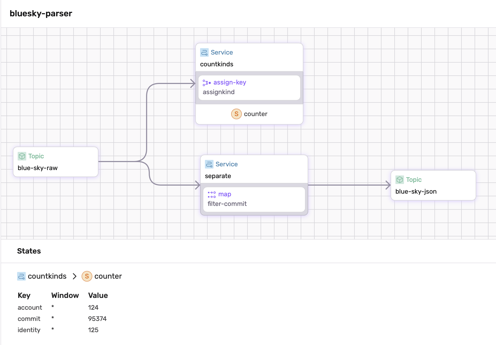

# Bluesky Fluvio Connectors
This project builds data connectors to process data streams from Bluesky into fluvio topics. The connectors ingest raw JSON input from Bluesky, process and transform the data, and output it to specified topics for further use. And SDF dataflow is provided for the user.

## Overview

This project includes:
1. Connector files in `/conn`
2. A make file
3. a sdf `dataflow.yaml` file

## Running the project

0. Make sure fluvio clusters have started
1. To run the connectors for ingesting all the information or only user texts run `make`
2. To run the sdf dataflow counts the different kinds of bluesky updates, run `sdf run --ui`

## Outputs

Raw Data Topic: Topics `blue-sky-raw` and `blue-sky-raw-comment` contain the raw data streamed from bluesky
- To consume the data run `fluvio consume <...>`
Processed Data Topic: Topics created after running sdf
- `blue-sky-json`
SDF Metrics: Aggregated counts of different kinds of Bluesky updates, visible in the SDF UI with the service `countkinds`.

